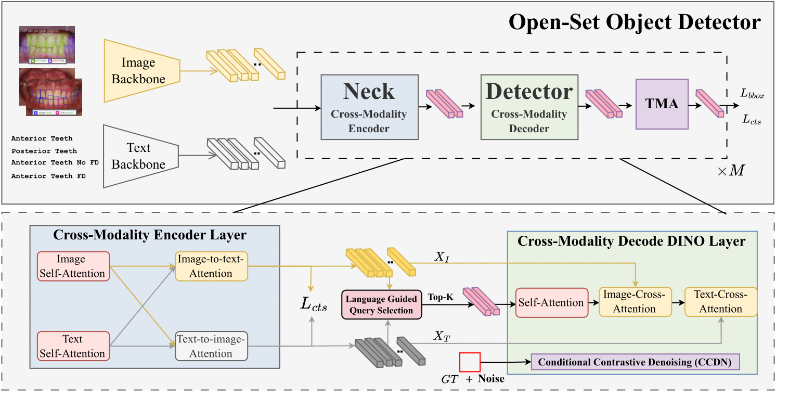
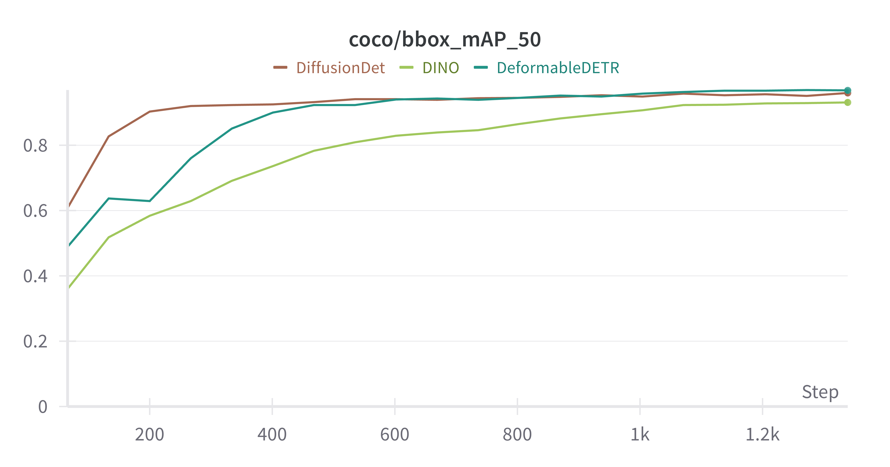

# FD-SOS: 基于视觉-语言开放集检测器的口腔内图像骨开窗和骨开裂检测

###### [Marawan Elbatel](https://marwankefah.github.io/), Keyuan Liu, Yanqi Yang, [Xiaomeng Li](https://xmengli.github.io/)

[English](README.md) | 简体中文

这是FD-SOS框架的官方实现，用于在口腔内图像中利用**开放集**检测器进行**骨开窗和骨开裂**（**FD**）**筛查**。

## 摘要

准确检测骨开窗和骨开裂（FD）对于牙科的有效治疗计划至关重要。虽然锥形束计算机断层扫描（CBCT）是评估FD的金标准，但它存在辐射暴露、可及性有限以及相比口腔内图像成本更高等限制。在口腔内图像中，牙医在FD的鉴别诊断方面面临挑战。本文提出了一种新颖且具有临床意义的FD检测应用，仅使用口腔内图像进行检测。为此，我们提出了FD-SOS，一种用于从口腔内图像检测FD的新型开放集目标检测器。FD-SOS具有两个新颖组件：条件对比去噪（CCDN）和牙齿特异性匹配分配（TMA）。这些模块使FD-SOS能够有效利用外部牙科语义。实验结果表明，我们的方法在性能上超越了现有的检测方法，并在相同精度水平下比牙科专业人士的召回率高出35%。



## 快速开始

### 安装环境

1. 克隆仓库：
    ```sh
    git clone https://github.com/MybcyQzqxw/FD-SOS.git
    cd FD-SOS
    ```

2. 创建虚拟环境：
    ```sh
    conda create -n SOS python=3.8 -y
    conda activate SOS
    ```

3. 安装 [PyTorch](https://pytorch.org/get-started/locally/)：
    ```sh
    pip3 install torch==2.1.2+cu118 torchvision==0.16.2+cu118 torchaudio==2.1.2+cu118 --index-url https://download.pytorch.org/whl/cu118
    ```

4. 按照 [mmdet](https://mmdetection.readthedocs.io/en/latest/get_started.html) 安装依赖项：
    ```sh
   bash requirements.sh
    ```

### 下载数据、模型和配置

5. 下载图像数据：
    ```sh
    # 下载图像
    gdown https://drive.google.com/uc?id=1Xm794_tzCh1TtIfJYJLFlmv013GTL_Uh
    unzip images_all.zip -d data/v1/
   ```

6. 下载模型权重和配置文件：
   ```sh
    # 下载模型权重
    gdown --folder https://drive.google.com/drive/folders/1zgNxQEXhGm3FTIQAKqkYd3YH0O5SHhm_
    ```

## 生成预测和评估

要使用训练好的模型/权重生成预测，请确保已下载图像、模型权重和配置文件：

1. 运行推理：
    ```sh
    python inference.py
    ```

2. 模型将推理结果输出到评估文件夹。要评估生成预测的COCO指标：
    ```sh
    python evaluate.py
    ```

### 结果和模型

我们提供详细的结果和模型权重，以便于重现性和进一步研究。

| 方法                           | 多任务    | AP75FD    | APFD      | AP50FD    | AP75      | AP        | AP50      | 模型权重      |
|-------------------------------|-----------|-----------|-----------|-----------|-----------|-----------|-----------|--------------|
| **传统检测器***                |           |           |           |           |           |           |           |              |
| Diffusion-DETR 无预训练       | ✗         | 0.04      | 1.31      | 7.58      | 0.04      | 1.7       | 8.85      | [下载](https://drive.google.com/drive/folders/1l9EsF5x8QTV3x0QT6yKeBpAAkR8fIiqH?usp=drive_link) |
| Diffusion-DETR                | ✗         | 55.52     | 51.42     | 61.28     | 62.58     | 59.06     | 66.37     | [下载](https://drive.google.com/drive/folders/1wtbbvAHTwpmRHfyMjc2xuYbBAqvHrY7L?usp=drive_link) |
| DDETR                         | ✗         | 56.92     | 50.41     | 60.51     | 62.68     | 57.44     | 65.48     | [下载](https://drive.google.com/drive/folders/1lWdPoUGe5HQvq5eU4SPCPnXLCf47pqwD?usp=drive_link) |
| DINO                          | ✗         | 54.03     | 49.68     | 57.94     | 55.13     | 51.65     | 57.65     | [下载](https://drive.google.com/drive/folders/1yuxNT8OQefXn7fmcY6P7yvWgNY5pPRz3?usp=drive_link) |
| **开放集检测器 †**             |           |           |           |           |           |           |           |              |
| GLIP                          | ✗         | 40.57     | 32.0      | 46.34     | 51.3      | 40.47     | 55.85     | [下载](https://drive.google.com/drive/folders/1sqnFCCi9mWEBcGhUw1flZUwCz8Y70efO?usp=drive_link) |
| GDINO                         | ✗         | 58.32     | 56.59     | 61.07     | 63.69     | 62.59     | 65.89     | [下载](https://drive.google.com/drive/folders/1dnZ010Yo-Xix1Pd56beTPaIfopSpUfVb?usp=drive_link) |
| GLIP                          | ✔️        | 41.78     | 33.68     | 47.09     | 51.97     | 42.73     | 56.7      | [下载](https://drive.google.com/drive/folders/1cZWXUyxbvhJhiikW8srecyOyhMYAmEOA?usp=sharing) |
| GDINO (我们的基线)             | ✔️        | 55.55     | 54.75     | 59.99     | 62.6      | 62.08     | 65.81     | [下载](https://drive.google.com/drive/folders/1wiwm1j90HTiriB5UX4gwFRN4_In679FL?usp=sharing) |
| **FD-SOS (我们的方法)**        | ✔️        | **62.45** | **60.84** | **66.01** | **67.07** | **65.97** | **69.67** | [下载](https://drive.google.com/drive/folders/1tY1yDnCE3AA7crXGiHNBN5fGb-zi4XVN?usp=drive_link) |

#### *需要在从ImageNet预训练权重初始化后在公共牙科数据集上进行预训练。
#### † 指对现有VLM预训练模型进行微调。

传统目标检测器在没有公共牙科数据集预热的情况下会失败。我们为传统目标检测器提供预热模型，可在[这里]()获取。

<div style="text-align: center;">
    
</div>

## 训练FD-SOS

要训练FD-SOS，请按照[快速开始](#快速开始)说明安装依赖项。

所有实验的配置文件都在 [train_FD.sh](train_FD.sh) 中提供。

要运行FD-SOS基准测试，确保所有图像都在 [data/v1/images_all](data/v1/images_all) 中，然后运行：
```bash
bash train.sh
```

## 特性

- 🦷 **专门针对牙科应用**：专为口腔内图像中的骨开窗和骨开裂检测而设计
- 🔍 **开放集检测**：能够检测训练期间未见过的牙科异常
- 🧠 **视觉-语言融合**：结合视觉和语言信息以提高检测性能
- ⚡ **高性能**：在相同精度水平下，召回率比牙科专业人士高出35%
- 🔬 **临床相关**：提供无需CBCT的FD检测解决方案

## 目录结构

```
FD-SOS/
├── configs/                 # 配置文件
│   ├── FD-SOS/             # FD-SOS专用配置
│   ├── deformable_detr/    # Deformable DETR配置
│   ├── dino/               # DINO配置
│   └── grounding_dino/     # Grounding DINO配置
├── data/                   # 数据目录
│   └── v1/                 # 版本1数据
├── mmdet/                  # MMDetection核心代码
├── tools/                  # 训练和测试工具
├── evaluation/             # 评估结果
├── experiments/            # 实验结果
└── graphs/                 # 图表和可视化
```

## 贡献

我们欢迎贡献！请随时提交问题或拉取请求。

## 许可证

本项目采用相应的开源许可证。详情请查看LICENSE文件。

## 致谢

代码基于 [mmdet](https://mmdetection.readthedocs.io/en/latest/get_started.html) 构建。

## 引用

如果您在研究中使用此代码，请引用我们的论文：

```bibtex
@inproceedings{elbatel2024fd,
  title={FD-SOS: Vision-Language Open-Set Detectors for Bone Fenestration and Dehiscence Detection from Intraoral Images},
  author={Elbatel, Marawan and Liu, Keyuan and Yang, Yanqi and Li, Xiaomeng},
  booktitle={International Conference on Medical Image Computing and Computer-Assisted Intervention},
  pages={629--639},
  year={2024},
  organization={Springer}
}
```

## 联系方式

如有任何问题，请通过以下方式联系我们：
- 📧 Email: [联系邮箱]
- 🌐 Project Page: [项目主页]
- 📝 Paper: [论文链接]

---

<div align="center">
<b>⭐ 如果这个项目对您有帮助，请给我们一个星标！ ⭐</b>
</div>
